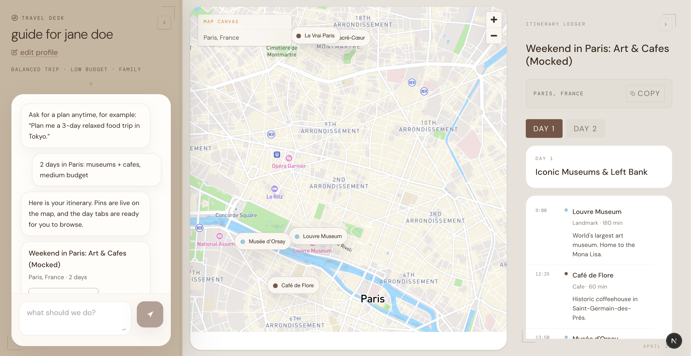

# Compass 🧭

Compass (also known as Wandermap) is an AI-powered travel itinerary planner that generates highly personalized day-by-day travel routes. Built with Next.js and Mapbox, it features an interactive, highly-structured side-by-side UI where you can chat with an AI assistant on the left, explore live-updating map pins in the center, and manage your day-to-day schedule in a dedicated Itinerary Ledger on the right.

## Screenshots

<div align="center">
  
  <br />
  <br />
  
  <br />
  <br />
  
</div>

## Features

- **AI Travel Assistant:** Chat with an AI to generate personalized 1-3 day itineraries based on your specific vibes, budget, and group size.
- **Interactive Map Canvas:** Powered by Mapbox, watch as your custom route and points of interest are instantly plotted on the map.
- **Itinerary Ledger:** A structured side panel to review and manage your generated travel plans, broken down day by day.
- **Travel Profiles:** An onboarding flow to capture your travel style (relaxed, active, etc.), budget, and interests to ensure the AI tailors the trip perfectly to you.
- **Minimalist Design System:** Features a unique paper-like aesthetic, translucent frosted overlays, and a dynamic side-by-side inset layout.

## Tech Stack

- **Framework:** Next.js (App Router)
- **Styling:** Tailwind CSS (v4)
- **Maps:** Mapbox GL JS
- **AI:** OpenAI API (via AI SDK)
- **Schema Validation:** Zod

## Getting Started

### Prerequisites
You will need Node.js installed, as well as API keys for Mapbox and OpenAI.

### Installation

1. **Clone the repository and install dependencies:**
   ```bash
   npm install
   ```

2. **Environment Variables:**
   Create a `.env.local` file in the root of the project and add your API keys:
   ```env
   NEXT_PUBLIC_MAPBOX_ACCESS_TOKEN=your_mapbox_token_here
   OPENAI_API_KEY=your_openai_api_key_here
   ```

3. **Run the development server:**
   ```bash
   npm run dev
   ```

4. **Explore the App:**
   Open [http://localhost:3000](http://localhost:3000) with your browser. Fill out your travel profile, ask the travel desk to "plan a 3-day relaxed food trip in Tokyo", and watch your itinerary come to life!
